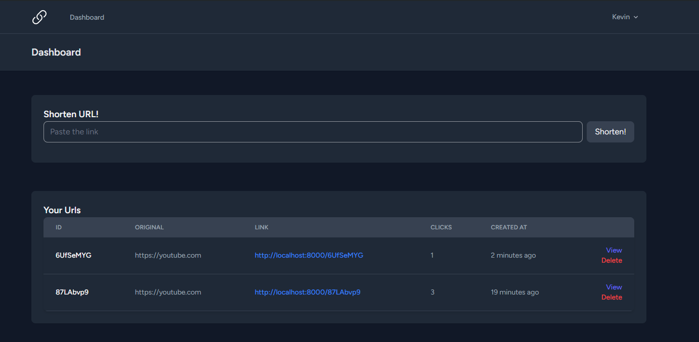

# URL Shortener with IP Lookup Feature

This project is a simple URL shortener with an added IP lookup feature, designed to be both straightforward and highly practical.

## Usage

1. Clone this project `git clone https://github.com/url-shawty`
2. Go to project directory `cd url-shawty`
3. Install composer dependencies `composer install`
4. Install npm dependencies `npm install`
5. Generate .env key `php artisan key:generate`
6. Migrate database `php artisan migrate`
7. Build assets `npm run build`
8. Run application `php artisan serve`

## Routes Documentation

### Authenticated Routes

#### Dashboard

-   **URL:** `/dashboard`
-   **Method:** GET
-   **Controller:** `UrlController@index`
-   **Named Route:** `dashboard`
-   **Middleware:** `auth`, `verified`

#### URL Index

-   **URL:** `/`
-   **Method:** GET
-   **Controller:** `UrlController@index`
-   **Middleware:** `auth`, `verified`

#### URL Inspection

-   **URL:** `/url/{url}/inspect`
-   **Method:** GET
-   **Controller:** `UrlController@inspect`
-   **Named Route:** `url.inspector`
-   **Middleware:** `auth`, `verified`

#### URL Resource (Store and Delete only)

-   **URL:** `/url`
-   **Methods:**
    -   POST: Create a new URL (`store`)
    -   DELETE: Delete a URL (`destroy`)
-   **Controller:** `UrlController`
-   **Middleware:** `auth`, `verified`

### Profile Routes

#### Edit Profile

-   **URL:** `/profile`
-   **Method:** GET
-   **Controller:** `ProfileController@edit`
-   **Named Route:** `profile.edit`
-   **Middleware:** `auth`

#### Update Profile

-   **URL:** `/profile`
-   **Method:** PATCH
-   **Controller:** `ProfileController@update`
-   **Named Route:** `profile.update`
-   **Middleware:** `auth`

#### Delete Profile

-   **URL:** `/profile`
-   **Method:** DELETE
-   **Controller:** `ProfileController@destroy`
-   **Named Route:** `profile.destroy`
-   **Middleware:** `auth`

### Guest Routes

#### URL Show (Public Access)

-   **URL:** `/{url}`
-   **Method:** GET
-   **Controller:** `UrlController@show`
-   **Named Route:** `url.show`
-   **Middleware:** None

### Authentication Routes

-   These routes are defined in `auth.php` and handle authentication logic.

---

### Notes:

-   **Middleware Groups:**
    -   `auth`: Ensures users are authenticated.
    -   `verified`: Requires users to have verified their email addresses.
-   **Controllers:**
    -   `UrlController`: Handles URL related actions (`index`, `inspect`, `store`, `destroy`, `show`).
    -   `ProfileController`: Manages user profile actions (`edit`, `update`, `destroy`).
